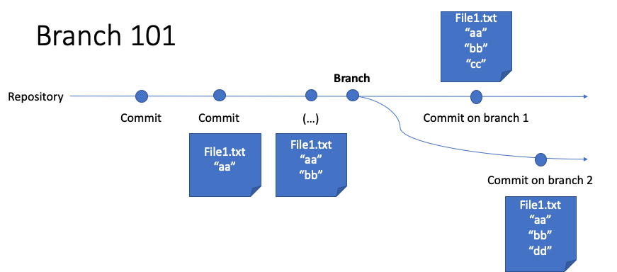
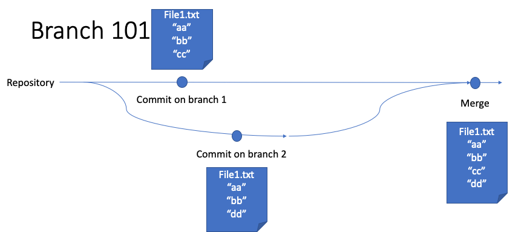
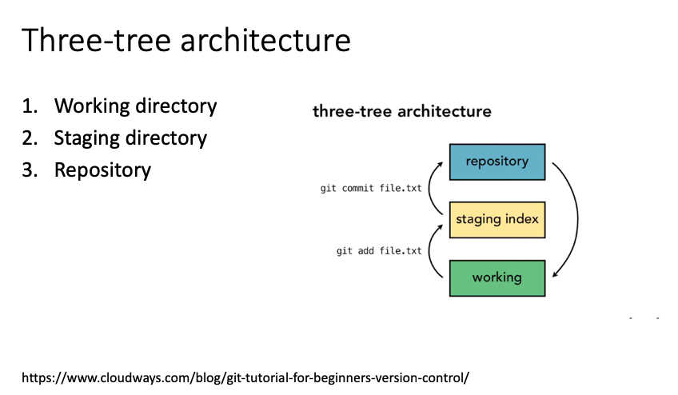
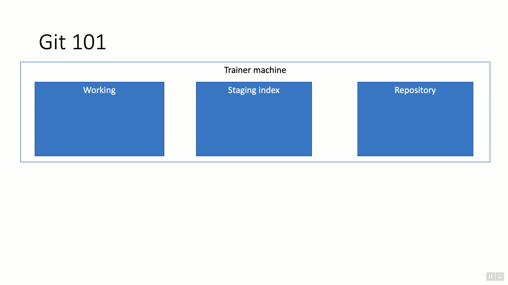
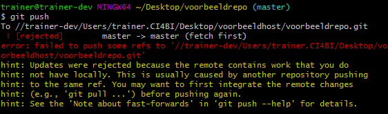
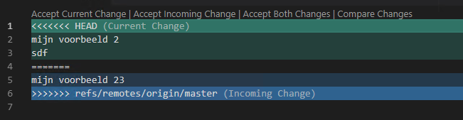

# Git samenwerk-demo

## Uitleg

Verschil tussen Git en versiebeheersystemen als SVN, Mercurial, TFS / TVCS etc.:

* gedistribueerd
* branching & merging is niet iets moeilijks, maar de standaard
* Mogelijkheid voor een "rebase" (aanpassen van vorige commits)

## Branching

In versiebeheer normaal gesproken "versies": nieuwere versie wordt naast de oudere versie opgeslagen, zodat je "heen" en "terug" kunt in de tijd.

Branching is de mogelijkheid om parallel aan twee versies van een product te werken. In het voorbeeld op de slide loopt tijd van links naar rechts.

Tot en met commit 3 was er maar een versie van de tijdslijn, maar daarna is er een _branch_ gemaakt waarin de versies onafhankelijk van elkaar worden bijgehouden. De ontwikkelaars op branch 1 hebben nu geen impact van wat de ontwikkelaars op branch 2 uitvoeren.

In veel software-ontwikkeling worden branches bijvoorbeeld gebruikt om _features_ te ontwikkelen en gelijktijdig een stabiel product te bewaren.

Branches kunnen ook weer samengevoegd worden. In het voorbeeld van hierboven bijvoorbeeld wanneer een feature stabiel genoeg is om opgenomen te worden in het standaardproduct.

## Git 101 demo

1. *Trainer* maakt een git repository aan
   * `git init voorbeeldrepo`
1. *Trainer* voegt tekstbestand toe aan repo
   * `cd voorbeeldrepo`
   * `git add tekstbestand.txt`
1. *Trainer* voert commit door
   * `git commit -m "Initiële commit"`
   * *-m is het argument voor "commit message"*
1. *Trainer* opent GitHub en maakt een nieuwe repository aan - *hier is nog geen repository!*
   * Vooraf heeft de trainer de cursisten toegevoegd aan deze repository, anders hadden ze geen toegang gehad
1. *Trainer* laat zien dat een bestaande (lokale) git repository naar GitHub gebracht kan worden
1. *Cursisten* navigeren naar GitHub
1. *Cursisten* doen een *clone* van de repository

## Uitleg "Three-tree architecture"

1. Je werkt in je "werkdirectory" - dat is de map waarin we zojuist het bestand aanmaakten.
2. Wanneer je een "git add" doet, wordt de data in "staging" gezet
3. Met een "commit" komt de data echt versiebeheerd in een repository terecht.

## Working with Git

Bedenk dat je altijd de huidige status van je Git repository kunt opvragen met **`git status`**.

1. Maak een tekstbestand aan (bijv. met Notepad) en opslaan in working directory
2. Open **Git CMD** (of, wanneer je al eens met Bash gewerkt hebt: **Git Bash**)
3. Bestand toevoegen aan staging met `git add mijnbestand.txt mijntweedebestand.txt`
4. Commit van je staging door `git commit -m "Mijn commit message"`
   * Wanneer je `-m` vergeet, krijg je een popup van Visual Studio Code om alsnog een commit message toe te voegen.
   * Wanneer je dit bestand opslaat en Visual Studio Code weer sluit, wordt je commit doorgevoerd.
5. Bekijk je commits met `git log`

### Uitleg "blessed repo"

Git is in essentie gedecentraliseerd: elk van de repositories bestaat op zich, en er bestaat niet een centrale server met "de waarheid" of iets dergelijks.

Tegelijk is het wel handig om met elkaar af te spreken wat je als "De Waarheid" ziet. Binnen Git wordt dan gesproken van een "blessed repo": een repository waarvan we als team afspreken dat deze centraal wordt behandeld.

Dit is exact hoe GitHub ook werkt: GitHub Repositories zijn eigenlijk de "blessed repos" waarin de "ware versie" staat waar iedereen in integreert.

## Working with Git 2

1. *Cursisten* passen het door de trainer toegevoegde tekstbestand aan. Wie het eerst pusht, wint :-)
2. *Trainer* laat vervolgens zien hoe je een "resolve" doet van conflicten (de trainer is uiteindelijk ook hier een paar versies achter)
   * `git add .`
   * `git commit -a -m "My Superior Change"`
   * `git push`  

   * Er zijn twee dingen die hier moeten gebeuren:
      1. Fetch van de laatste versie
      2. Merge van de wijzigingen (pull = fetch + merge)
   * *trainer* bespreekt slides over local & remote repositories
   * Doorvoeren van wijzigingen
      1. `git fetch`. Wijzigingen staan nu lokaal
      2. `git merge` faalt, door een conflict
      3. `git status` laat ook dit conflict zien:
      4. Open bestand in teksteditor:
         * <<<<<<< HEAD geeft het begin van het conflict aan.
         * De tekst tot aan "=======" geeft aan wat in de repository staat waar je heen probeert te pushen
         * De tekst vanaf "=======" tot aan ">>>>>>> refs/remotes/origin/master" geeft jouw versie van de waarheid aan
         * Diverse editors (waaronder Visual Studio Code), diff- en merge-tools hebben ingebouwde ondersteuning om dit te lezen en te kiezen tussen twee versies.  
         
      5. Corrigeer het tekstbestand z.d.d. het correct is.
      6. Voer de wijzigingen door met `git add`
      7. Doe een commit van de merge met `git commit`
      8. Doe een push met `git push`
