# Azure Repos lab

Met de kennis over Git in het achterhoofd werken we nu vanuit de grafische schil van GitHub Desktop. Onderstaande stappen voer je uit op je cursusmachine. Dit is een Windows-machine met daarop de volgende software geïnstalleerd:

* Git for Windows
* GitHub Desktop
* Visual Studio Code
* Notepad++
* Google Chrome
* SQL Server

## GitHub Desktop

Om eenvoudig Git te gebruiken binnen Windows, maken we gebruik van **GitHub Desktop**.

1. **Open** op je cursusmachine **GitHub Desktop**. Wanneer je deze niet kunt vinden, trek even aan de bel!
2. **Log in** met je persoonlijke GitHub-account.

## Kopie maken van de trainings-repository

3. Log in op GitHub op [https://www.github.com/BITrainer-nl/git-github-workshop](https://www.github.com/BITrainer-nl/git-github-workshop)
4. Klik op de groene knop "Use this template".

Je krijgt nu een kopie van de trainings-repository, die je in je persoonlijke GitHub-account opslaat en kunt blijven gebruiken.

5. Vul een naam in, en klik op de groene knop **Create repository from template**

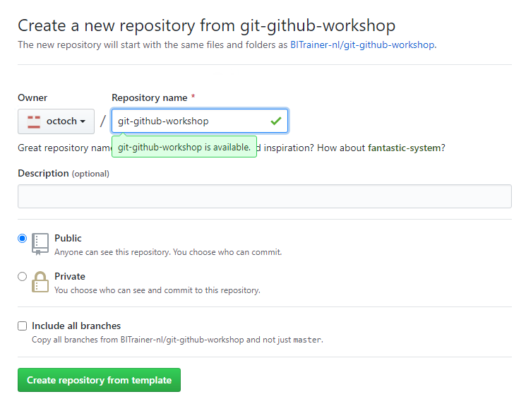

## Clone de nieuwe repository

6. Navigeer nu op Github.com naar je **eigen** repository die zojuist is aangemaakt. (in het voorbeeld hierboven dus `octoch/git-github-workshop`)
7. "Clone or download" (rechtsboven)
8. Klik op **Open in Desktop**
   * 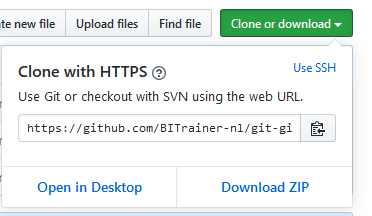

De GitHub-applicatie opent zich, en vraagt waar je de repository lokaal wilt opslaan. Er is vanuit Git geen beperking in de plaatsing.

9. Kies een locatie waar je de *clone* wilt opslaan, en klik op **Clone**

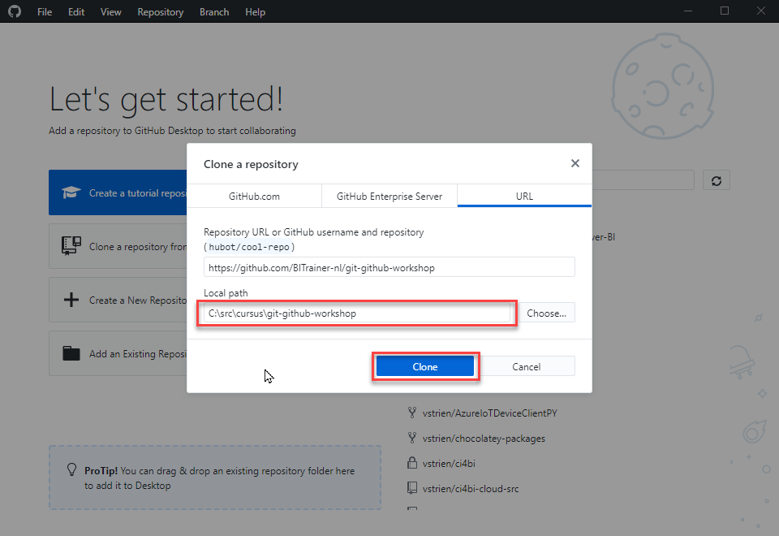

GitHub Desktop biedt je drie acties om de repository - waar je zojuist een *clone* van hebt genomen - te benaderen:

* Open in Visual Studio Code
* Show in Explorer
* View on GitHub

10. Kies voor **Show in Explorer**, en bekijk waar de Git *repository* zich op schijf bevindt.

### Maak iets stuk

11. **Klik** binnen GitHub Desktop op de knop **Open in Visual Studio Code**
12. Open `Sales.sql`
13. Verwijder regel 10 (hier staat de tekst `);`)
14. Sla het bestand op, en open **Source Control** - het volgende pictogram:
    * 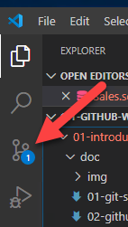

Je ziet nu de wijzigingen die je gemaakt hebt binnen je *working directory* staan onder het kopje *Changes*. Voordat het bestand in versiebeheer ondergebracht kan worden, moet het eerst naar de *staging directory*:

15. Onder het kopje **Changes**, klik op het **plus-teken** naast de **Sales.sql**:
    * 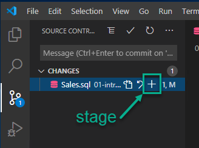
    * Het bestand komt nu onder een nieuw kopje **Staged Changes** te staan
16. Voer een commit message in, en klik op het vinkje om de *commit* door te voeren.
    * 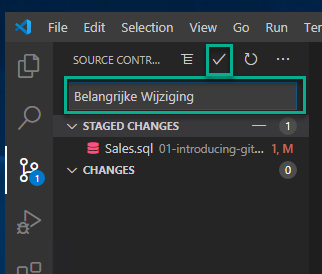
    * Met de "commit" heb je de nieuwe code weliswaar in je lokale repository opgeslagen, maar nog niet naar de "blessed repo" gepusht.
    * In Visual Studio wordt dit vaak een "Synchronize Changes" genoemd: pull, daarna push.
    * (Feitelijk veroorzaakt elke *sync* dus drie Git-acties: *fetch - merge - push*)
17. Zorg ervoor dat de commit die je zojuist gedaan hebt ook op de server belandt.
18. Verifieer op de *GitHub website* dat je wijziging daadwerkelijk doorkomt.
19. Bekijk ook het knop "History". Als het goed is, zie je hier de *commit* die je zojuist gedaan hebt terug.

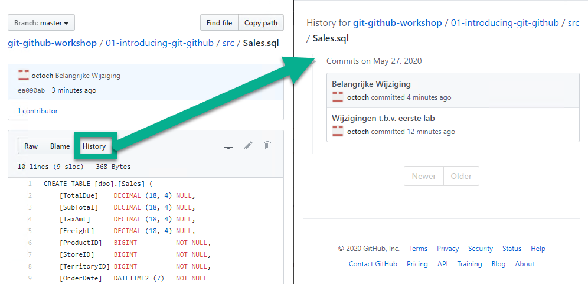

### Fix the build

De eenvoudigste manier om de build te corrigeren is momenteel om een "rollback" te doen van bepaalde wijzigingen.

20. Open **GitHub Desktop**
21. Met de trainings-repository geopend, kies voor de tab *History*
22. Navigeer door eerdere wijzigingen in de *repository*, en bekijk de wijzigingen die door de tijd heen gemaakt zijn.
23. Selecteer de meest recente wijziging. Aan de rechterzijde zie je dat in deze commit:
    * (a) Binnen Sales.sql
    * (b) Regel 10 verwijderd is
    * (c) Regel 10 bevatte de tekst `);`
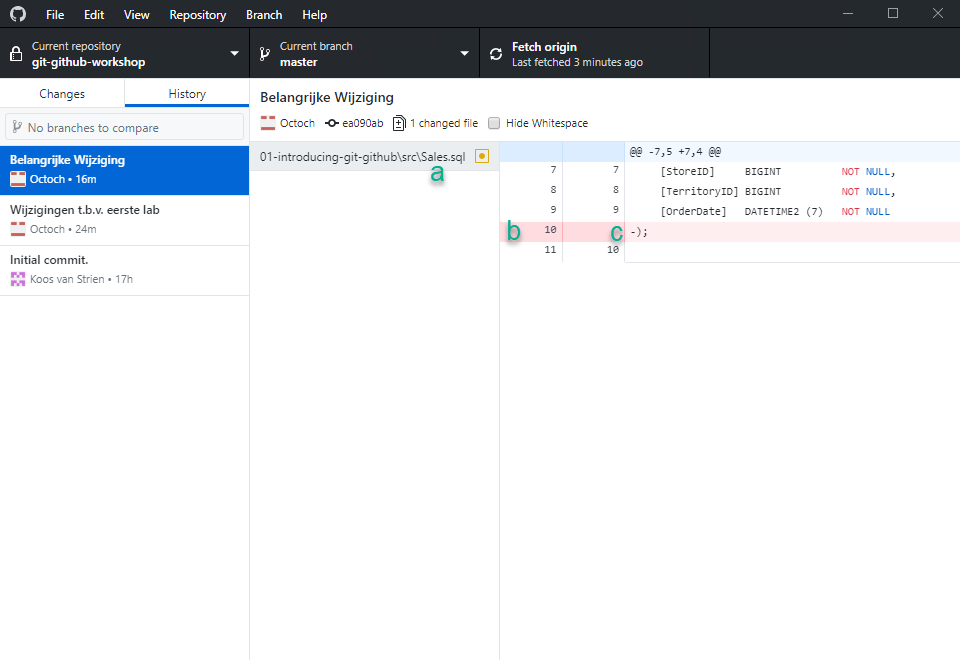

24. Onder **History**, **rechtsklik** op de **meest recente commit**.
25. Kies **Revert this commit**.

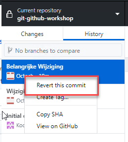

26. Synchroniseer de nieuwe lijst met commits richting de *blessed repo*, en verifieer dat de code nu weer correct staat.

#### Revert vs. checkout

We hebben hier zojuist een *revert* uitgevoerd. Dit is een eenvoudige en heldere actie, die alle wijzigingen binnen een commit ongedaan maakt in een nieuwe commit. Wanneer je slechts enkele wijziging wilt terugzetten, kun je ook gebruikmaken van een `checkout` van een specifieke versie van een bestand. Deze optie is helaas niet binnen de GUI van GitHub Desktop aanwezig:

27. Pas het bestand `Sales.sql` opnieuw aan, verwijder regel 10
28. Zet op regel 10 nu de tekst `/* ONGEWENSTE WIJZIGING */`
29. Pas nu ook het bestand `SalesViaSSIS.sql` aan. Voeg hier op regel 2 de tekst `/*GEWENSTE WIJZIGING*/` in.
30. Sla de bestanden op, en doe een commit. *Doe hier geen sync, we voeren dit buiten de blessed repo uit*
31. Bekijk de geschiedenis binnen **GitHub Desktop**, en verifieer dat je *commit* correct is doorgevoerd
32. Open **Git Bash** of **Git cmd**, en navigeer naar de map waar je repository staat (bijv. `C:\src\git-github-workshop`). Hier kun je de volgende commando's voor gebruiken:

|                                               | Bash         | Cmd          |
|-----------------------------------------------|--------------|--------------|
| Huidige map weergeven                         | pwd          | cd           |
| Veranderen van map                            | cd (mapnaam) | cd (mapnaam) |
| Scheidingsteken tussen parent- en childmappen | /            | \            |
| Inhoud van een map weergeven                  | ls           | dir          |

33. Geef het commando `git log -3`. Dit geeft je een lijst met de drie laatste wijzigingen.
34. Noteer de eerste zes tekens van de hash van de meest recente (bovenste) commit (bijv. `bb371d`)
35. Haal nu één bestand terug uit een andere *commit*. Dit kan met het commando `git checkout`.
   * Dit ziet er bijvoorbeeld als volgt uit (let op: Git is case sensitive!)  
   `git checkout bb371d~ src\Sales.sql` (voor cmd)  
   `git checkout bb371d~ src/Sales.sql` (voor bash)  
      * De **zes tekens (`bb371d`)** identificeren hier de commit
      * De **tilde (`~`)** geeft aan dat we een checkout willen doen van de versie vóór de commit die hier aangegeven is (dus in dit geval de commit voorafgaand aan bb371d)
      * Het **pad (src/.../.sql)** geeft aan welk bestand we uit die commit willen ophalen
36. Voer `git status` uit. 
    * Waar is het zojuist opgehaalde bestand terecht gekomen? In je working directory, je staging index of is het al opgenomen in een commit?
37. Bekijk in **Visual Studio Code** of **GitHub Desktop** of de bestanden `Sales.sql` en `SalesViaSSIS.sql` nu correct zijn
    * De ongewenste wijziging van `Sales.sql` moet verdwenen zijn
    * De gewenste wijziging van `SalesViaSSIS.sql` moet nog aanwezig zijn
38. Zorg ervoor dat deze gecorrigeerde aanpassing naar GitHub gebracht wordt. Je kunt dit naar keuze vanaf de commandline doen, binnen GitHub Desktop of binnen Visual Studio Code.

# Welke Git-commando's zijn er eigenlijk?

Hoewel je Git goed kunt gebruiken binnen Visual Studio Code en/of GitHub, loop je vroeg of laat tegen de beperkingen van de grafische interfaces aan en heb je de command-line nodig. Dat ziet er even anders uit dan de grafische omgeving, maar is vaak verrassend gebruiksvriendelijk: als je de basis van Git snapt en de berichten leest, word je vaak bij de hand genomen wat er moet gebeuren. Hieronder zie je een aantal voorbeelden:

## Push

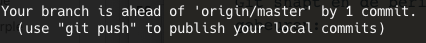

Je hebt (volgens de meest recente informatie van Git) één commit lokaal staan die nog niet op de remote repository bekend is. Je krijgt de tip om `git push` te gebruiken om deze te publiceren.

## Push / reset

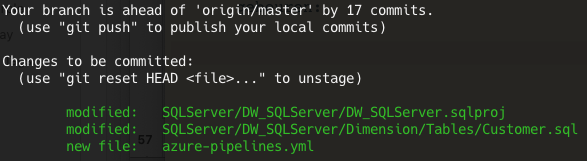

* Je hebt 17 commits lokaal staan, die niet bij de remote repository bekend zijn. Een `git push` publiceert jouw nieuwe commits
* Je hebt drie wijzigingen in je *staging index* staan die nog niet *committed* zijn. Als je deze weer uit de staging wilt halen kan dit met `git reset HEAD <bestandsnaam>`

## Add / Checkout

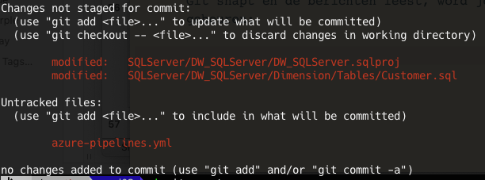

Er zijn twee bestanden gewijzigd die nog niet staged zijn.

* Je kunt deze bestanden toevoegen met `git add`
* Je kunt de wijzigingen ongedaan maken met `git checkout --` (in dat geval ben je dus je lokale wijzigingen kwijt!

Daarnaast ziet Git één bestand wat nog niet in versiebeheer is opgenomen (`azure-pipelines.yml`). Je kunt deze toevoegen met `git add`

Ten slotte ziet Git dat er momenteel niets in staging staat, en geeft je een hint hoe je bestanden kunt toevoegen voor een commit (`git add` of `git commit -a`)

## Cheatsheet en kort overzicht van commando's

Er zijn twee veelgebruikte Git cheatsheets waarin je alle commando's ziet staan:

* [Een (printbare) PDF van GitHub](https://github.github.com/training-kit/downloads/github-git-cheat-sheet.pdf)
* [Een interactieve website, opgebouwd vanuit de diverse "tiers" van Git](http://ndpsoftware.com/git-cheatsheet.html)

Op de website van Git ook een [uitgebreid overzicht van beschikbare commando's](https://git-scm.com/docs)

| Command  | Meaning                                       |
|----------|-----------------------------------------------|
| init     | Initialize new repository                     |
| clone    | Clone a repository into a new directory       |
| add      | Add new files from working tree to snapshot   |
| status   | Show the working tree status                  |
| commit   | Record changes in the repository              |
| rm       | Remove files from working tree and from index |
| mv       | Move or rename a file                         |
| branch   | List, create or delete branches               |
| checkout | Switch branches                               |
| merge    | Join two or more branches                     |
| fetch    | Download from another repository              |
| pull     | fetch + merge                                 |
| push     | Upload to another repository                  |
| remote   | Manage set of tracked repositories            |
