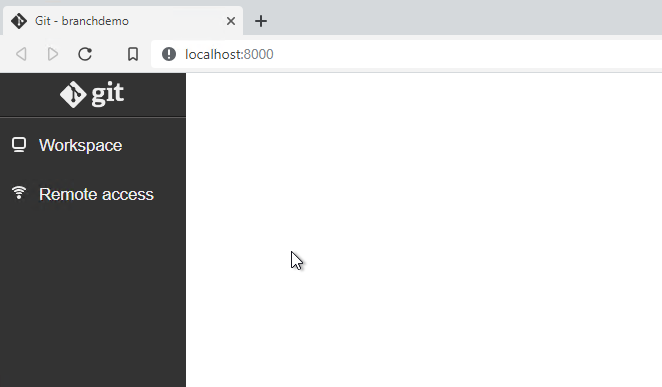
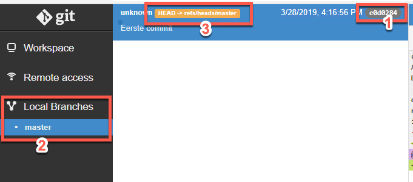
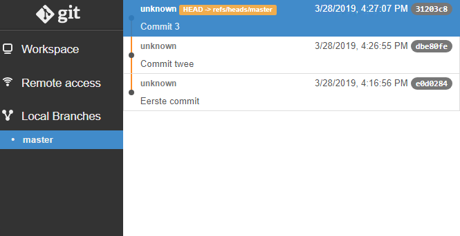
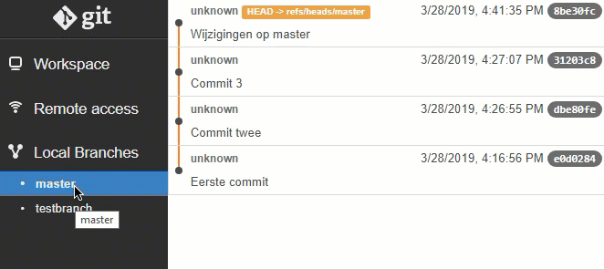

# Branching in Git

Branching in Git wordt weleens omschreven als de "killer feature". Om heel duidelijk te houden waar we mee bezig zijn, gebruiken we gedurende deze uitbreiding genaamd [Git webui](https://github.com/alberthier/git-webui) waarmee je eenvoudig inzicht krijgt in je huidige repository.

| Command  | Meaning                                       |
|----------|-----------------------------------------------|
| init     | Initialize new repository                     |
| clone    | Clone a repository into a new directory       |
| add      | Add new files from working tree to snapshot   |
| status   | Show the working tree status                  |
| commit   | Record changes in the repository              |
| rm       | Remove files from working tree and from index |
| mv       | Move or rename a file                         |
| branch   | List, create or delete branches               |
| checkout | Switch branches                               |
| merge    | Join two or more branches                     |
| fetch    | Download from another repository              |
| pull     | fetch + merge                                 |
| push     | Upload to another repository                  |
| remote   | Manage set of tracked repositories            |

## Opstarten

1. Open een Git CMD of Git Bash shell
2. Maak een nieuwe repository aan met behulp van `git init branchdemo`
3. Verander de directory naar de branchdemo.
4. Start webui via het commando `git webui`
5. Minimaliseer het Git CMD of Bash venster. Zolang webui draait kun je geen gebruik maken van dit Git venster.
6. Open een nieuw Git CMD of Bash shell, en navigeer opnieuw naar de directory van de branchdemo-repository

**Wanneer Internet Explorer per abuis opent, kopieer en plak dan de URL vanuit Internet Explorer naar Chrome voor een correcte weergave**

In de browser zie je de Git repository zoals deze er nu uit ziet: leeg.

## Aanmaken van eerste commits

1. Voeg een nieuw tekstbestand toe aan je working directory, met de naam `1.txt`
   * Een manier om dit snel vanaf een commandline te doen (zowel CMD als Bash) is met de opdracht `echo "1" > 1.txt`
2. Zorg ervoor dat dit bestand in een commit meegenomen wordt.  
   Geef als commit message "Eerste commit" mee.
3. Ververs nu het browser-venster.

Je ziet dat er nu een paar zaken veranderd zijn:

1. De zojuist toegevoegde commit wordt weergegeven in het middenvenster
2. Aan de linkerzijde is een onderdeel **Local Branches** toegevoegd, met daaronder het woord **master**
3. De HEAD-pointer wordt aangeduid

Git is specifiek gebouwd om goed met *branching* om te kunnen gaan. Zozeer zelfs, dat ook als je niet expliciet branches aanmaakt, Git het nog steeds beschouwt alsof je in een branch werkt. Standaard maakt Git één branch voor je aan met de naam **master**.

De **HEAD-pointer** geeft aan naar welke **branch** je momenteel kijkt wanneer je je working directory opent.

4. Voeg nog de volgende zaken toe aan je repository, en bekijk de resultaten in webui:
   * Een bestand genaamd "2.txt". Voeg deze toe in een commit met message "Commit twee"
   * Een bestand genaamd "3.txt". Voeg deze toe met commit message "Commit 3"

Webui ziet er nu als volgt uit:

## De eerste branch

Stel nu dat je even wat zaken wilt testen binnen je verder zeer stabiele oplossing. Binnen Git is het dan heel gebruikelijk om hier een branch voor aan te maken. Wijzigingen die je in een branch aanmaakt hebben namelijk geen impact op andere branches, en het is eenvoudig om branches later weer samen te voegen (een *merge*). Je kunt branches aanmaken met het commando `git branch`.

1. Maak een branch genaamd `testbranch`
   * `git branch testbranch`
2. Voordat je kunt werken op deze branch, moet je eerst een `checkout` doen:
   * `git checkout testbranch`
3. Je kunt op dezelfde wijze terugschakelen naar de oorspronkelijke branch (`master`):
   * `git checkout master`
4. Bekijk in `webui` de effecten van de `checkout`:
   * als het goed is zie je de **HEAD-pointer** verplaatsen: deze geeft aan naar welke branch je momenteel "kijkt" wanneer je je working directory bekijkt.
5. Met `testbranch` actief gaan we wat aanpassingen doorvoeren in de tekstbestanden. Voeg in bestanden 1.txt en 3.txt wat tekst toe met bijv. Notepad++ of Visual Studio Code.
6. Voer dit door met een commit
7. Schakel nu terug naar de `master branch`. Zoals je zult zien zijn de wijzigingen hier niet aangekomen.
8. Doe nu enkele andere wijzigingen in de bestanden 2.txt en 3.txt, en voer ook dit door met een commit
9. Bekijk de resultaten van je commits in Git Webui

Zoals je ziet leven er nu twee branches naast elkaar, die geen invloed op elkaar hebben. De eerste drie commits van deze branches zijn echter identiek!

## De tweede branch

Terwijl je nog middenin je testproject zit, treedt er op productie een issue op. Daar moet met spoed aan ontwikkeld worden, maar natuurlijk wel tegen de versie van je product die momenteel in productie staat. Hoe doe je dat in Git?

* In master staat gewoonlijk de versie die ook naar productie gebracht wordt
* Je maakt een nieuwe branch aan, direct op master
* Hier voer je de wijzigingen in door, doet eventuele testen, etc.
* Wanneer de hotfix voltooid is, voer je een *merge* richting master uit, en wordt de hotfix dus in de master-branch opgenomen
* De nieuwe master-versie wordt naar productie gebracht.

Dit alles heeft geen impact op je bestaande werkzaamheden en verdere ontwikkelingen in `testbranch`: dat werk staat onveranderd op je te wachten!

Voer bij het onderstaand stappenplan telkens `git status` uit om je acties te verifiëren: gebeurt er daadwerkelijk wat je verwacht?

1. Schakel naar de `master` branch
2. Maak een nieuwe branch `hotfix`
3. Schakel over naar deze nieuwe branch
4. Voeg het woord "bugfix" toe aan 3.txt
   * Dit kun je snel doen met `echo "bugfix" >> 3.txt`
5. Commit deze wijziging

De wijziging staat nu in de `hotfix` branch, maar nog niet in `master`. We kunnen de branches samenvoegen met `git merge`:

6. Schakel over naar `master`
7. `git merge hotfix`
8. Verwijder nu de `hotfix` branch met `git branch -d hotfix`

## Roundup: Git Branching

We hebben in deze module gekeken naar branching in Git. Om daarop te kunnen focussen hebben we dat in een lokale repository gedaan, met een lokale Git GUI om meer inzicht te geven in wat er gebeurt.

Er zijn veel verschillende grafische interfaces voor Git geschreven - naast de hier door ons gebruikte **git webui** (een soort "plugin" voor Git) kun je ook eens kijken naar **gitk** en **git-gui**. Alles wat je hiervoor hoeft te doen is binnen *Git Bash* of *Git CMD* naar de directory van een repository te gaan, en daar resp. `gitk` of `git-gui` uit te voeren. Ook is er een lijst met veelgebruikte GUIs te vinden op de officiële Git site: [https://git-scm.com/downloads/guis](https://git-scm.com/downloads/guis).

Bij het ontwikkelen met behulp van GitHub zul je iets minder vaak van deze GUIs gebruik maken: meestal werk je met een *blessed repository* binnen GitHub (waar je lokale repository een *clone* van is), en binnen GitHub heb je goede grafische weergaves van wat er zich afspeelt binnen een repository.
